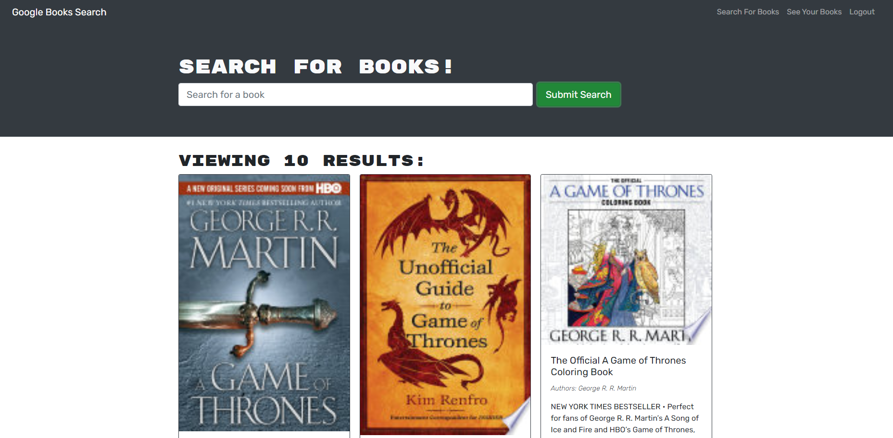
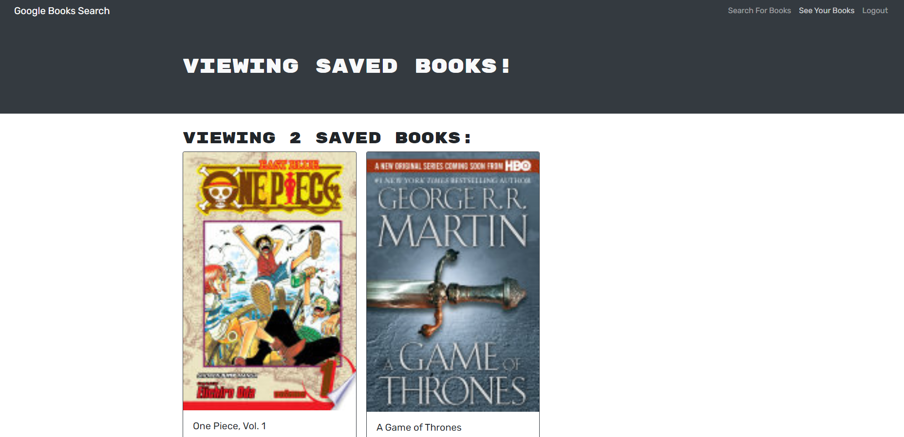

# Mern Book Search

  ## Description
  
  A simple web app designed to save books to personal profile, and remove them. Books are referred to with Google Books API. Remaining functionality is built with the MERN approach, where the database is internalized with GraphQL, and server is built with Node's express library, and React runs the client side of the application.
  
  ## Table of Contents 
    
  - [Installation](#installation)
  - [Usage](#usage)
  - [Credits](#credits)
  - [License](#license)
  - [Credits](#credits)
  - [Tests](#tests)
  - [Questions](#questions)
  
  ## Installation
  
  Use application link provided: https://book-search-mw.herokuapp.com/ 

   
  ## Usage
  
  Use like a normal application:
  
   

     
     
  
  ## Credits
  
  none
  
  ## License
  
  

  https://opensource.org/licenses/MIT

  ---
  
  ## Tests
  
  none

  ## Questions

  GitHub: https://github.com/MarquisWillis

  Email: mailto:marquiswillis99@gmail.com

  Use mailto link above

  